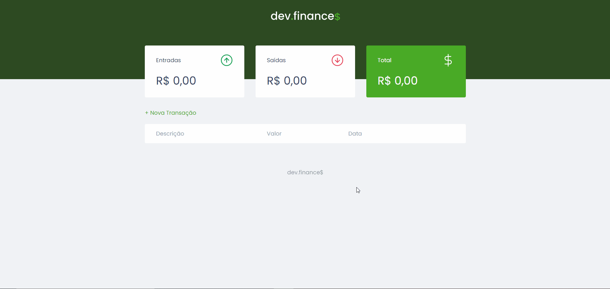

<h1 align="center">

 
</h1>

<h2 align="center"> Um projeto de controle financeiro construído durante o evento Maratona Discover da RocketSeat.</h2>

 

<h3 align="center">
 
    <a href="https://controlefinanceiro.netlify.app/" target="_blank"> <strong> Demo on Netlifly </strong> </a></h3>
 

## :rocket: Tecnologias e ferramentas

- JavaScript
- CSS 3
- HTML 5
- VS Code

## :memo: Licença

Este projeto está sob a licença do MIT. Consulte a [LICENÇA](https://github.com/igoririneu/pagina_de_captura_Game-News/blob/main/LICENSE) para obter mais informações.

 

Feito com ♥ por Igor Irineu :wave: [Entre em contato!](https://www.linkedin.com/in/igoririneu/)
